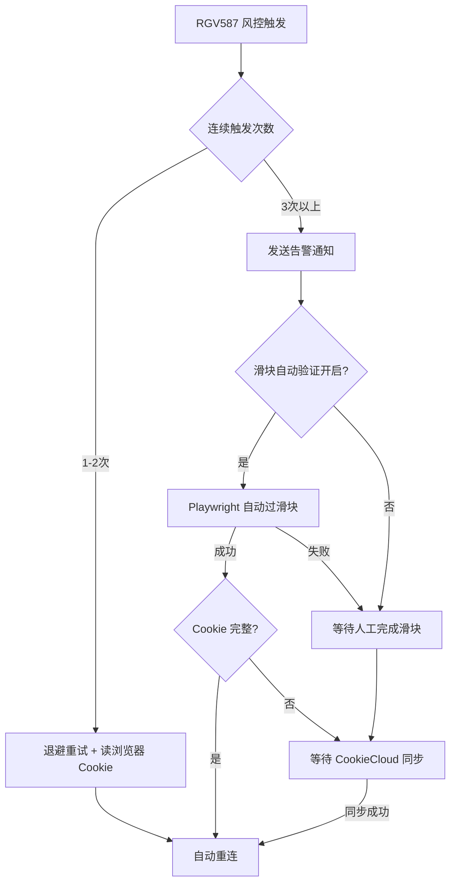
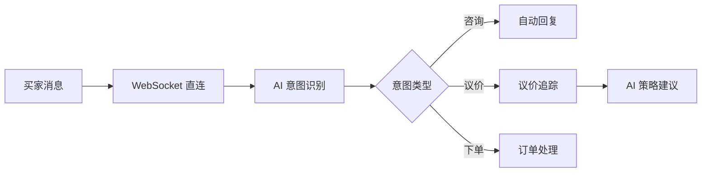

<div align="center">

# 🦞 Xianyu OpenClaw — 闲鱼虚拟商品卖家自动化平台

[](https://github.com/G3niusYukki/xianyu-openclaw/actions)
[](https://www.python.org/downloads/)
[](https://nodejs.org/)
[](tests/)
[](LICENSE)

**⚡ 从消息到履约，全流程自动化 · 从监控到告警，全链路可观测**

[English](#english) | [简体中文](#简介) | [快速开始](#-快速开始) | [文档](docs/)

</div>

---

## 📖 简介

**Xianyu OpenClaw（闲鱼管家）** 是专为闲鱼(Xianyu/Goofish)虚拟商品卖家设计的 **API-first 全自动化工作台**。

通过 WebSocket 直连闲鱼消息通道，结合 AI 实现智能回复、自动报价、商品管理和订单履约，帮助卖家实现 7×24 小时无人值守运营。

### 🎯 为什么创建这个项目？

闲鱼作为国内最大的二手交易平台，虚拟商品卖家面临以下痛点：

| 痛点 | 传统方案 | Xianyu OpenClaw 方案 |
|------|---------|---------------------|
| 消息回复不及时 | 人工盯盘，响应慢 | WebSocket 毫秒级接收 + AI 自动回复 |
| 报价效率低 | 手动计算，易出错 | 智能报价引擎，自动识别地址/重量/时效 |
| Cookie 频繁失效 | 手动更新，中断服务 | 后台自动刷新，无感知续期 |
| 多店铺管理困难 | 频繁切换账号 | 统一配置中心，支持多账号 |
| 异常无法及时感知 | 被动发现问题 | 多渠道告警（飞书/企微），关键事件不漏接 |

---

## 🎉 v3.0 重大更新

### 核心新功能

| 功能 | 描述 | 版本 |
|------|------|------|
| 🛡️ **风控滑块自动验证** | RGV587 触发后自动检测 NC/拼图滑块并模拟拖拽，Playwright + OpenCV | v3.0 |
| 🔄 **CookieCloud 集成** | 浏览器扩展即时同步 Cookie，风控恢复秒级生效，免手动复制 | v3.0 |
| 🎯 **自动回复引擎增强** | 30+ 意图规则、售后自动转人工、复购引导、系统通知过滤 | v3.0 |
| 💰 **多店铺首单优惠修正** | 报价模板"首单价格"改"参考价格"，跨店场景正确引导 | v3.0 |
| 🖼️ **商品图片模板重构** | 7 个新视觉模板 + 统一渲染引擎，支持自定义字体/配色 | v3.0 |
| 🖥️ **macOS LaunchAgent** | 一键安装后台守护服务，开机自启动 | v3.0 |
| 📝 **前端 TypeScript 迁移** | 全部页面组件迁移至 TypeScript，类型安全 | v3.0 |

### 风控自动恢复架构



---

## 🎉 v2.0 重大更新

### 核心新功能

| 功能 | 描述 | 版本 |
|------|------|------|
| 🔐 **Cookie 静默自动刷新** | 后台守护线程每30分钟自动检查，失效时从浏览器静默获取新 Cookie | v2.0 |
| 📢 **多通道告警通知** | 支持飞书、企业微信 Webhook，覆盖售后、发货、人工接管等全场景 | v2.0 |
| 🎨 **可视化配置中心** | Cookie 配置页支持粘贴验证、AI 配置支持6家提供商引导 | v2.0 |
| 🔍 **API 可用性校验** | 实时健康检查面板，5大服务状态一目了然 | v2.0 |
| 💬 **双层消息去重** | 精确 hash + 内容 hash，防止重复回复 | v2.0 |
| 💰 **智能议价追踪** | 议价计数器辅助 AI 策略，自动识别讨价还价 | v2.0 |
| 🧹 **架构重构** | 清理 240+ 废弃文件，Python 后端统一化 | v2.0 |

---

## ✨ 核心功能

### 📨 消息自动化



- **WebSocket 直连** — 毫秒级消息接收，无需轮询
- **AI 意图识别** — 自动识别咨询、议价、下单意图
- **双层去重** — 精确 hash + 内容 hash，防重复回复
- **议价追踪** — 智能计数器，辅助 AI 议价策略
- **合规护栏** — 禁词拦截、频率限制、审计日志

### 📦 商品自动化

- **AI 内容生成** — 标题、描述、标签一键生成
- **自动上架** — HTML模板 → 截图 → OSS → API发布
- **价格监控** — 自动调价、擦亮、上下架
- **多店铺管理** — 支持多账号切换和独立配置

### 🚚 订单自动化

- **自动发货** — 虚拟商品自动发卡密
- **物流同步** — 闲管家 API 对接，实时状态更新
- **售后处理** — 退款、退货自动识别和响应

### 📊 监控告警

- **Cookie 健康** — 自动检测、静默刷新、失效告警
- **服务状态** — 5大服务实时健康检查面板
- **多渠道告警** — 飞书/企业微信，关键事件不漏接
- **数据看板** — 曝光、转化、订单数据实时可视化

---

## 🏗️ 技术架构

### 系统架构图

```
┌─────────────────────────────────────────────────────────────────┐
│                     🎨 React 前端 (Vite)                        │
│  ┌──────────┐ ┌──────────┐ ┌──────────┐ ┌──────────┐           │
│  │ Dashboard│ │ 商品管理 │ │ 订单中心 │ │ 系统配置 │           │
│  └──────────┘ └──────────┘ └──────────┘ └──────────┘           │
└───────────────────────────┬─────────────────────────────────────┘
                            │ HTTP / WebSocket
┌───────────────────────────┴─────────────────────────────────────┐
│                    🐍 Python 后端 (asyncio)                     │
│  ┌──────────┐ ┌──────────┐ ┌──────────┐ ┌──────────┐           │
│  │ WebSocket│ │ AI 服务  │ │ 报价引擎 │ │ 任务调度 │           │
│  │ 消息监听 │ │          │ │          │ │          │           │
│  └──────────┘ └──────────┘ └──────────┘ └──────────┘           │
│  ┌──────────┐ ┌──────────┐ ┌──────────┐ ┌──────────┐           │
│  │ Cookie   │ │ 告警通知 │ │ 数据分析 │ │ 合规中心 │           │
│  │ 自动刷新 │ │          │ │          │ │          │           │
│  └──────────┘ └──────────┘ └──────────┘ └──────────┘           │
└─────────────────────────────────────────────────────────────────┘
```

### 技术栈

| 层级 | 技术 | 说明 |
|------|------|------|
| **前端** | React 18 / Vite / TailwindCSS / TypeScript | 响应式管理面板 |
| **后端** | Python 3.10+ / asyncio | WebSocket 消息、AI 回复、报价引擎、配置管理 |
| **数据库** | SQLite | 零配置，内嵌运行，WAL 模式优化并发 |
| **消息通道** | WebSocket 直连闲鱼 | 毫秒级接收，内存队列 + SQLite 持久化 |
| **AI 服务** | OpenAI 兼容 API | 支持 DeepSeek、通义千问、智谱、火山方舟等 |
| **通知** | HTTP Webhook | 飞书、企业微信 |

---

## 🚀 快速开始

### 三项准备

| 必备项 | 说明 | 获取方式 |
|--------|------|---------|
| **闲鱼 Cookie** | 登录凭证 | 浏览器 F12 复制，或启动后在管理面板自动获取 |
| **AI API Key** | 自动回复 | 推荐 [DeepSeek](https://platform.deepseek.com)（便宜好用） |
| **闲管家凭证** | 订单/发货 | [闲管家开放平台](https://open.goofish.pro) 注册获取 |

### 方式一：交互式快速启动（推荐新用户）

```bash
git clone https://github.com/G3niusYukki/xianyu-openclaw.git
cd xianyu-openclaw

# macOS / Linux（自动安装依赖 + 配置引导 + 启动）
bash quick-start.sh

# Windows
quick-start.bat
```

脚本自动完成：环境检查 → 依赖安装 → 配置创建 → 服务启动 → 首次使用引导。国内网络自动切换镜像源。

### 方式二：Docker 部署（推荐生产）

```bash
git clone https://github.com/G3niusYukki/xianyu-openclaw.git
cd xianyu-openclaw
cp .env.example .env
# 编辑 .env，填入 Cookie、AI Key、闲管家凭证（只需 3 项）

docker compose up -d                          # 国际网络
MIRROR=china docker compose up -d --build     # 国内网络
```

### 方式三：一键启动（已有环境）

```bash
./start.sh     # macOS / Linux
start.bat      # Windows
```

### 方式四：手动安装

```bash
git clone https://github.com/G3niusYukki/xianyu-openclaw.git
cd xianyu-openclaw

python3 -m venv .venv && source .venv/bin/activate
pip install -r requirements.txt
playwright install chromium
cd client && npm install && cd ..

cp .env.example .env
# 编辑 .env 填入 3 项必填配置

# 启动（需要 2 个终端）
python -m src.dashboard_server --port 8091   # 终端 1
cd client && npx vite --host                 # 终端 2
```

### 访问地址

- **管理面板**: http://localhost:5173
- **后端 API**: http://localhost:8091

> 详细部署方案、生产加固和运维指南见 [docs/DEPLOYMENT.md](docs/DEPLOYMENT.md)

---

## 📖 使用指南

### 首次配置（3 分钟上手）

1. **账户管理** → 粘贴 Cookie 或点击「自动获取」
2. **系统配置 → AI** → 选择服务商、填入 API Key
3. **系统配置 → CookieCloud** → 填入浏览器扩展的 UUID 和密码（推荐）
4. **消息 → 对话沙盒** → 测试自动回复效果
5. 确认无误后开启自动回复

### 核心工作流

```
买家消息 → WebSocket 接收 → AI 意图识别 → 自动回复/报价
                ↓
        议价意图 → 议价计数器 → AI 策略建议
                ↓
        下单意向 → 订单同步 → 自动发货
                ↓
        异常情况 → 多渠道告警 → 人工接管
```

---

## ⚙️ 配置说明

### 环境变量 (.env)

只需 3 项必填即可运行，其余均有默认值：

```bash
# 必填
XIANYU_COOKIE_1=你的闲鱼Cookie
AI_API_KEY=你的AI密钥
XGJ_APP_KEY=闲管家AppKey
XGJ_APP_SECRET=闲管家AppSecret

# 可选（有默认值）
AI_PROVIDER=deepseek              # deepseek / openai / qwen / zhipu
AI_BASE_URL=https://api.deepseek.com/v1
AI_MODEL=deepseek-chat
MESSAGES_ENABLED=true
```

> 完整配置项和详细说明见 `.env.example`

### CookieCloud 配置（可选，推荐）

CookieCloud 是浏览器扩展，可将 Cookie 实时同步到服务端，风控恢复时秒级生效：

```bash
# 环境变量方式
COOKIE_CLOUD_UUID=your-uuid        # CookieCloud 用户 ID
COOKIE_CLOUD_PASSWORD=your-password  # CookieCloud 加密密码
```

也可在前端「系统设置 → 集成服务 → CookieCloud 配置」中填写。

### 风控滑块自动验证配置（可选）

在前端「系统设置 → 集成服务 → 风控滑块自动验证」中开启：

| 参数 | 说明 | 默认值 |
|------|------|--------|
| `enabled` | 是否启用自动过滑块 | `false` |
| `max_attempts` | 单次风控最大尝试次数 | `3` |
| `cooldown_seconds` | 两次尝试间冷却时间 | `60` |
| `headless` | 是否无头模式运行浏览器 | `false` |

> **风险提示**：自动过滑块存在账号封控风险，建议配合 CookieCloud 使用，优先通过手动验证恢复。

### 系统配置页面

可视化配置（v2.0 起）：
- **AI 设置** - 6家提供商引导卡片，一键切换
- **Cookie 设置** - 粘贴验证、实时评级、获取指南
- **告警通知** - Webhook 配置、事件开关、测试发送
- **闲管家 API** - AppKey / Secret 管理
- **CookieCloud** - 同步配置、手动同步按钮（v3.0）
- **风控滑块自动验证** - 开关/参数/风险提示（v3.0）

---

## 📊 监控告警

### 实时健康面板

Dashboard 集成 4 大服务状态：
- 🟢 Python 后端  
- 🟢 Cookie 健康
- 🟢 AI 服务
- 🟢 闲管家 API

### 告警场景

| 场景 | 级别 | 通知渠道 |
|------|------|----------|
| Cookie 过期 | P0 | 飞书 + 企业微信 |
| RGV587 风控滑块触发 | P0 | 飞书 + 企业微信 |
| Cookie 自动刷新成功 | P1 | 飞书 |
| 滑块自动验证成功/失败 | P1 | 飞书 |
| 售后介入 | P1 | 飞书 |
| 发货失败 | P1 | 飞书 |
| 人工接管 | P2 | 飞书 |

---

## 🗂️ 项目结构

```
xianyu-openclaw/
├── src/                          # Python 后端
│   ├── main.py                   # 主入口
│   ├── cli.py                    # CLI 工具
│   ├── dashboard_server.py       # Dashboard API
│   ├── core/                     # 核心模块
│   │   ├── cookie_health.py      # Cookie 健康检查
│   │   ├── cookie_grabber.py     # Cookie 自动刷新
│   │   ├── slider_solver.py      # 风控滑块自动验证（NC/拼图）
│   │   ├── notify.py             # 通知模块
│   │   └── playwright_client.py  # 浏览器自动化
│   ├── dashboard/                # Dashboard 服务层
│   │   ├── config_service.py     # 配置管理服务
│   │   ├── repository.py         # 数据仓库
│   │   └── router.py             # 路由注册
│   └── modules/                  # 业务模块
│       ├── messages/             # 消息（去重、议价、回复）
│       │   ├── service.py        # 消息服务
│       │   ├── reply_engine.py   # 意图规则引擎（30+ 规则）
│       │   ├── workflow.py       # 会话状态机
│       │   └── ws_live.py        # WebSocket 消息监听
│       ├── listing/              # 商品（上架、模板、OSS）
│       │   ├── service.py        # 商品服务
│       │   ├── auto_publish.py   # 自动发布
│       │   └── image_generator.py # 图片生成
│       ├── orders/               # 订单（同步、发货）
│       │   ├── service.py        # 订单服务
│       │   └── xianguanjia.py    # 闲管家集成
│       ├── virtual_goods/        # 虚拟商品（卡密）
│       ├── quote/                # 报价引擎
│       │   ├── engine.py         # 报价核心
│       │   └── providers.py      # 报价数据源
│       ├── analytics/            # 数据分析
│       └── accounts/             # 账号管理
├── client/                       # React 前端（TypeScript）
│   └── src/
│       ├── pages/                # 页面
│       │   ├── config/           # 系统配置（含CookieCloud/滑块）
│       │   ├── accounts/         # 店铺管理
│       │   ├── products/         # 商品管理
│       │   └── analytics/        # 数据分析
│       └── components/           # 组件
│           ├── ApiStatusPanel.tsx # 状态面板
│           └── SetupGuide.tsx    # 引导组件
├── tests/                        # 测试
├── config/                       # 配置模板
│   ├── config.example.yaml       # 主配置示例
│   ├── categories/               # 品类配置
│   └── templates/                # 回复模板
├── docs/                         # 文档
├── database/                     # 数据库迁移
├── docker-compose.yml            # Docker 编排
├── scripts/                      # 脚本工具
│   ├── install-launchd.sh        # macOS LaunchAgent 安装
│   └── uninstall-launchd.sh      # macOS LaunchAgent 卸载
├── start.sh                      # 一键启动（macOS/Linux）
└── start.bat                     # 一键启动（Windows）
```

---

## 🛠️ 开发指南

```bash
# 开发模式（需要同时运行2个服务）
python -m src.dashboard_server --port 8091  # Python 后端
cd client && npx vite --host                # React 前端

# 或使用 Docker（推荐新手）
docker compose up -d
python -m src.cli doctor --strict

# 测试
pytest tests/ --cov=src --cov-report=html
ruff check src/
ruff format src/

# 构建
cd client && npm run build
```

---

## ❓ 常见问题

### Cookie 自动获取失败 / 无法打开浏览器窗口

**症状**：Dashboard 点击"自动获取 Cookie"显示"无法启动浏览器"或"所有获取方式均失败"。

**解决**：
1. 确认已安装 Playwright 浏览器：`playwright install chromium`
2. 确认本机已安装 Chrome 或 Edge 浏览器
3. 如需静默自动刷新（Level 1），需在本机 Chrome/Edge 中至少登录一次闲鱼

### Cookie 频繁失效 / WebSocket 断连

**症状**：消息监听中断，日志出现 `FAIL_SYS_USER_VALIDATE`。

**解决**：
1. 保持本机 Chrome/Edge 浏览器开启且闲鱼已登录，系统会自动从浏览器读取最新 Cookie
2. 确认 `COOKIE_AUTO_REFRESH=true` 已在 `.env` 中设置
3. 如无法保持浏览器登录，可在 Dashboard 手动粘贴 Cookie

### RGV587 风控滑块触发怎么办

**症状**：日志出现 `RGV587`，WebSocket 断连，告警通知"闲鱼触发风控验证"。

**解决**：
1. **推荐方案** — 安装 [CookieCloud](https://github.com/nichenqin/CookieCloud) 浏览器扩展：
   - Chrome/Edge 安装 CookieCloud 扩展
   - 在扩展中设置 UUID 和密码
   - 在前端「系统设置 → 集成服务 → CookieCloud 配置」中填入相同的 UUID 和密码
   - 在浏览器中手动通过闲鱼滑块验证后，CookieCloud 自动同步最新 Cookie
2. **自动方案** — 在前端「系统设置 → 集成服务 → 风控滑块自动验证」中开启自动过滑块（有封号风险，谨慎使用）
3. **手动方案** — 在 Dashboard「账户管理」页面粘贴新 Cookie

### CookieCloud 配置步骤

1. 安装 [CookieCloud](https://github.com/nichenqin/CookieCloud) 浏览器扩展
2. 扩展设置中：
   - 选择"自托管"或使用公共服务
   - 记录 UUID 和加密密码
3. 在前端「系统设置 → 集成服务 → CookieCloud 配置」中填入 UUID 和密码，保存
4. 当 Cookie 失效时，在浏览器登录闲鱼后点击 CookieCloud 扩展的"同步"，系统自动获取最新 Cookie

### Windows 上 Playwright 安装失败

**症状**：`playwright install chromium` 报错或超时。

**解决**：
1. 确认网络可以访问 `cdn.playwright.dev`
2. 如网络受限，可设置代理：`set HTTPS_PROXY=http://proxy:port` 后重试
3. 使用一键启动脚本 `start.bat` 会自动处理安装

---

## 📝 更新日志

### v3.0.0 (2026-03-08)

**新增功能**
- 🛡️ 风控滑块自动验证 — NC/拼图滑块自动解决（Playwright + OpenCV，三级浏览器策略）
- 🔄 CookieCloud 集成 — 浏览器扩展即时同步 Cookie，风控恢复秒级生效
- 🎯 自动回复意图引擎增强 — 30+ 规则，售后自动转人工，复购引导，系统通知过滤
- 💰 多店铺首单优惠修正 — 报价模板统一使用"参考价格"，避免跨店误导
- 🖼️ 商品图片模板重构 — 7 个新视觉模板 + 统一渲染引擎
- 🖥️ macOS LaunchAgent — 一键安装后台守护服务
- 📝 前端 TypeScript 迁移 — 全部页面和组件迁移至 TypeScript

**架构优化**
- 前端 UI 滑块配置区，含风险提示和参数调节
- 告警通知文案根据 CookieCloud / 滑块配置状态动态生成
- 会话状态机（WorkflowState）防止已下单后重复催单
- 意图规则引擎支持 `skip_reply`（系统通知静默跳过）

**部署改进**
- `requirements.txt` — `opencv-python` 改为 `opencv-python-headless`（Docker 兼容）
- `config.example.yaml` — 新增 `slider_auto_solve` 配置段
- `scripts/install-launchd.sh` — macOS 后台服务一键安装

### v2.0.0 (2026-03-07)

**新增功能**
- 🔐 Cookie 静默自动刷新（rookiepy + Playwright）
- 📢 飞书/企业微信告警通知
- 🎨 可视化配置中心（Cookie、AI、告警）
- 🔍 API 可用性实时健康面板
- 💬 双层消息去重（精确 hash + 内容 hash）
- 💰 智能议价追踪计数器

**架构优化**
- 🧹 清理 src/lite/ 等 240+ 废弃文件
- 📦 新增 src/core/notify.py 通用通知模块
- 🔧 统一配置管理，支持前端可视化编辑
- 📊 测试覆盖率提升至 95%

**Bug 修复**
- 修复 CI lint 错误（ruff + bandit）
- 修复测试冲突（conversion_rate_placeholder）
- 修复 axios 导入重复问题

[查看完整更新日志](CHANGELOG.md)

---

## 🤝 参与贡献

欢迎贡献代码！请阅读 [CONTRIBUTING.md](CONTRIBUTING.md) 了解规范。

### 贡献流程

1. Fork 仓库
2. 创建功能分支 (`git checkout -b feature/amazing`)
3. 提交更改 (`git commit -m 'feat: add amazing'`)
4. 推送分支 (`git push origin feature/amazing`)
5. 创建 Pull Request

---

## 📄 许可证

[MIT](LICENSE) © 2026 G3niusYukki

---

## 💬 联系我们

- **GitHub Issues**: 功能建议和 Bug 报告
- **Email**: 详见 GitHub Profile

---

## ⚠️ 免责声明

本工具仅供学习研究使用，请遵守闲鱼平台规则和相关法律法规。使用者需自行承担使用风险。

---

## English

### Introduction

**Xianyu OpenClaw** is an API-first full-automation workbench designed for virtual goods sellers on Xianyu (Goofish), China's largest second-hand trading platform.

By connecting directly to Xianyu's message channel via WebSocket and combining AI for intelligent replies, automatic quoting, product management, and order fulfillment, it helps sellers achieve 7×24 hour unattended operation.

### Key Features

- **Message Automation** — WebSocket direct connection, AI intent recognition, double-layer deduplication
- **Product Automation** — AI content generation, automatic listing, price monitoring
- **Order Automation** — Automatic delivery for virtual goods, logistics sync, after-sales handling
- **Monitoring & Alerting** — Cookie health monitoring, multi-channel alerts (Lark/WeCom), real-time dashboard

### Quick Start

```bash
git clone https://github.com/G3niusYukki/xianyu-openclaw.git
cd xianyu-openclaw

# Option 1: Interactive setup (recommended)
bash quick-start.sh            # macOS / Linux
quick-start.bat                # Windows

# Option 2: Docker (recommended for production)
cp .env.example .env           # Edit .env with Cookie + AI Key + XGJ credentials
docker compose up -d

# Option 3: Manual
python3 -m venv .venv && source .venv/bin/activate
pip install -r requirements.txt && playwright install chromium
cd client && npm install && cd ..
cp .env.example .env           # Edit .env
python -m src.dashboard_server --port 8091 &
cd client && npx vite --host
```

Access:
- Dashboard: http://localhost:5173
- API: http://localhost:8091

See [docs/DEPLOYMENT.md](docs/DEPLOYMENT.md) for production deployment guide.

---

<div align="center">

Made with ❤️ by G3niusYukki

</div>
