<div align="center">
  
  <!-- 动态 Logo -->
  
  
  <br>
  
  <!-- 徽章区域 -->
  <p align="center">
    <a href="https://github.com/G3niusYukki/xianyu-openclaw/releases/latest">
      
    </a>
    <a href="LICENSE">
      
    </a>
    <a href="https://github.com/G3niusYukki/xianyu-openclaw/actions/workflows/ci.yml">
      
    </a>
  </p>
  
  <p align="center">
    <a href="https://github.com/G3niusYukki/xianyu-openclaw/stargazers">
      
    </a>
    <a href="https://github.com/G3niusYukki/xianyu-openclaw/network/members">
      
    </a>
    <a href="https://github.com/G3niusYukki/xianyu-openclaw/issues">
      
    </a>
    <a href="https://www.python.org/downloads/release/python-3120/">
      
    </a>
  </p>

  <!-- 快速链接 -->
  <p align="center">
    <a href="#-快速开始">🚀 快速开始</a> •
    <a href="#-功能特性">✨ 功能特性</a> •
    <a href="#-系统架构">🏗️ 架构</a> •
    <a href="#-使用指南">📖 指南</a> •
    <a href="#-贡献指南">🤝 贡献</a> •
    <a href="#-更新日志">📝 更新</a>
  </p>

  <br>

  <!-- 演示 GIF/图片 -->
  
  
</div>

---

## 🎯 项目简介

**xianyu-openclaw** 是一款基于 [OpenClaw](https://github.com/openclaw/openclaw) AI Agent 框架构建的闲鱼店铺自动化工具。通过自然语言对话，AI 帮你打理闲鱼店铺，让你从繁琐的重复操作中解放出来。

### 💡 核心理念

```
用对话代替点击，让 AI 成为你的闲鱼店铺助手
```

### 🎬 使用场景

<div align="center">
<table>
<tr>
<td width="50%">

**📦 商品发布**
```
你: 帮我发布一个 iPhone 15 Pro
    价格 5999，95新

AI: ✅ 已发布！
    标题：【自用出】iPhone 15 Pro 
          256G 原色钛金属 95新
    链接：https://www.goofish.com/item/xxx
```

</td>
<td width="50%">

**✨ 批量擦亮**
```
你: 擦亮所有商品

AI: ✅ 已擦亮 23 件商品
    成功率: 100%
    耗时: 45秒
```

</td>
</tr>
<tr>
<td width="50%">

**💬 智能回复**
```
买家: 这个多少钱包邮？

AI: 北京 → 上海 1kg
    顺丰: 15元（预计1-2天）
    韵达: 8元（预计2-3天）
    回复"选XX快递"即可安排
```

</td>
<td width="50%">

**📊 数据洞察**
```
你: 今天运营数据怎么样？

AI: 📊 今日概况
    浏览: 1,247  👁️
    想要: 89     💬
    成交: 12     ✅
    营收: ¥38,700 💰
```

</td>
</tr>
</table>
</div>

---

## ✨ 功能特性

<table>
<tr>
<td valign="top" width="33%">

### 🤖 AI 驱动
- **自然语言操控** - 告别繁琐界面，对话式操作
- **智能内容生成** - AI 生成标题、描述、标签
- **意图识别** - 自动理解买家询价意图
- **多模型支持** - OpenAI / Claude / DeepSeek / 阿里百炼

</td>
<td valign="top" width="33%">

### 🛡️ 安全合规
- **分级合规策略** - 账号/会话级规则控制
- **内容安全过滤** - 自动拦截违规内容
- **Cookie 加密存储** - AES 加密保护账号安全
- **审计日志** - 完整操作追溯

</td>
<td valign="top" width="33%">

### ⚡ 高效稳定
- **WebSocket 长连接** - 实时消息收发
- **自动故障恢复** - 7×24 小时无人值守
- **智能降级** - API 失败自动回退 DOM 操作
- **双层去重** - 精准+内容双重消息去重

</td>
</tr>
<tr>
<td valign="top" width="33%">

### 💰 交易闭环
- **自动报价** - 智能运费计算
- **改价执行** - 闲管家 API 支持
- **虚拟发货** - 自动兑换码发放
- **物流跟踪** - 快递单号自动回填

</td>
<td valign="top" width="33%">

### 📈 数据运营
- **SLA 监控** - 首响 P95 / 报价成功率
- **每日报告** - 自动运营数据推送
- **A/B 测试** - 增长实验与漏斗分析
- **成本追踪** - AI 调用成本统计

</td>
<td valign="top" width="33%">

### 🔧 运维友好
- **一键部署** - Docker Compose 快速启动
- **可视化 Dashboard** - Web 界面管理
- **飞书告警** - 异常实时通知
- **数据备份** - 7 天自动轮转

</td>
</tr>
</table>

---

## 🚀 快速开始

> 默认与推荐：**Lite/Core 本地启动**  
> 默认地址：**http://127.0.0.1:8091**  
> 说明：`5173` 仅用于前端开发（Vite dev server）。

### 单一推荐启动路径（Lite/Core）

```bash
git clone https://github.com/G3niusYukki/xianyu-openclaw.git
cd xianyu-openclaw

cp .env.example .env
# 至少填写：
# - ANTHROPIC_API_KEY（或 OPENAI_API_KEY / MOONSHOT_API_KEY / MINIMAX_API_KEY / ZAI_API_KEY / CUSTOM_GATEWAY_API_KEY）
# - OPENCLAW_GATEWAY_TOKEN
# - AUTH_PASSWORD
# - XIANYU_COOKIE_1

python3.12 -m venv .venv312
source .venv312/bin/activate
pip install -r requirements.txt

python -m src.dashboard_server --host 127.0.0.1 --port 8091
```

浏览器打开：**http://127.0.0.1:8091**

### 首次验证（推荐一条命令）

```bash
bash scripts/verify-quickstart.sh
```

验证内容：
- 服务可启动（`/healthz`）
- Dashboard 可访问（`http://127.0.0.1:8091`）
- Cookie/配置就绪（`/api/get-cookie`）

日志文件：`logs/verify-quickstart.log`

### 可选路径（非推荐）

- Docker：`docker compose up -d`
- OpenClaw 深度模式（配对/网关运维）：见 `docs/DEPLOYMENT.md`

更多细节：`QUICKSTART.md` / `docs/DEPLOYMENT.md`

---

## 🏗️ 系统架构

```mermaid
graph TB
    subgraph "用户层"
        A[Web Dashboard]
        B[CLI 工具]
        C[飞书机器人]
    end

    subgraph "核心层"
        D[OpenClaw Gateway]
        E[消息路由引擎]
        F[工作流调度器]
    end

    subgraph "业务模块"
        G[售前模块]
        H[运营模块]
        I[售后模块]
    end

    subgraph "外部服务"
        J[闲鱼/闲管家 API]
        K[AI 模型服务]
        L[飞书 Webhook]
    end

    A --> D
    B --> D
    C --> D
    D --> E
    E --> F
    F --> G
    F --> H
    F --> I
    G --> J
    H --> J
    I --> J
    D --> K
    F --> L
```



---

## 📖 使用指南

| 文档 | 说明 | 适合人群 |
|------|------|----------|
| [📚 零基础使用指南](USER_GUIDE.md) | 详细配置与使用教程 | 初次使用者 |
| [⚡ 快速入门](QUICKSTART.md) | 5 分钟快速上手 | 有经验的开发者 |
| [🏗️ 部署指南](docs/DEPLOYMENT.md) | 生产环境部署 | 运维人员 |
| [🔌 API 文档](docs/API.md) | 接口定义与示例 | 开发者 |
| [🛡️ 安全说明](SECURITY.md) | 安全最佳实践 | 所有人 |

---

## 🤝 贡献指南

我们欢迎所有形式的贡献！无论是 bug 报告、功能建议还是代码提交。

### 快速开始

1. **Fork** 本仓库
2. **Clone** 你的 fork：`git clone https://github.com/YOUR_USERNAME/xianyu-openclaw.git`
3. **创建分支**：`git checkout -b feature/amazing-feature`
4. **提交更改**：`git commit -m 'Add amazing feature'`
5. **推送分支**：`git push origin feature/amazing-feature`
6. **创建 Pull Request**

详细贡献规范请查看 [CONTRIBUTING.md](CONTRIBUTING.md)。

### 贡献者

<a href="https://github.com/G3niusYukki/xianyu-openclaw/graphs/contributors">
  
</a>

---

## 📝 更新日志

详细更新历史请查看 [CHANGELOG.md](CHANGELOG.md)。

### 最新版本 v6.3.4 (2026-03-06)

- ✅ CI 测试修复：跨平台路径兼容性优化
- ✅ 状态合约稳定化：Dashboard API 字段规范化
- ✅ 严格模式增强：模块解释器锁定检查

---

## 🛡️ 安全声明

⚠️ **本项目仅供学习和研究使用，请遵守以下原则：**

1. 遵守闲鱼平台用户协议
2. 控制操作频率，避免对平台造成压力
3. 不用于任何违法违规用途
4. 生产环境使用前请进行充分的测试

详细安全说明请查看 [SECURITY.md](SECURITY.md)。

---

## 📄 许可证

本项目基于 [MIT License](LICENSE) 开源。

---

<div align="center">

**Star ⭐ 本项目如果它对你有帮助！**

<a href="https://github.com/G3niusYukki/xianyu-openclaw/stargazers">
  
</a>

<br><br>


</div>
