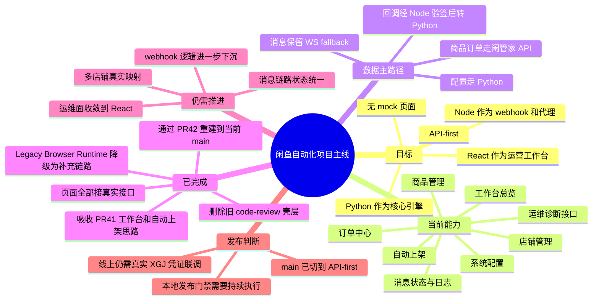

# 闲鱼项目一页图（当前主线版）

> 目标：5 分钟看懂当前项目的主线、已完成内容和下一步收口重点。
> 说明：这份文档描述的是当前 `main`，不再沿用旧的 OpenClaw 主路径口径。

## Mermaid 思维导图

## 精简文字版

### 1. 当前项目是什么

一句话：把闲鱼运营动作收敛到 `React 工作台 + Python 核心引擎 + Node 薄代理`，主路径优先使用闲管家 / Open Platform API。

### 2. 现在做到哪一步

- 工作台、商品、订单、配置、自动上架已经有真实接口入口。
- 旧 `client/server` code-review SaaS 壳层已经退出主路径。
- OpenClaw 不再是默认运行前提。

### 3. 当前最关键的剩余工作

1. 多店铺和账号映射做实。
2. 消息链路的状态和 fallback 策略统一上屏。
3. 历史 Python Dashboard 与 React 工作台的重复能力继续收敛。

### 4. 结论

项目已经从“旧壳层 + 多条混杂路径”收敛为“API-first 主线”，当前重点不再是推翻重写，而是把剩余运维和多店铺能力补齐并稳定发布节奏。
