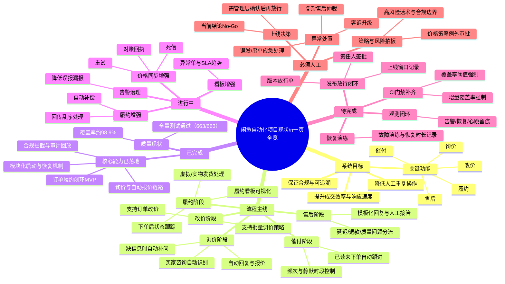

# 闲鱼项目一页图（老板速读版）V1

> 目标：**5分钟看懂全流程、当前进度、下一步卡点**。
> 说明：这是“业务视角”版本，尽量不用技术术语。

## Mermaid 思维导图（可直接粘贴渲染）

---

## 精简文字版（老板5分钟版）

### 1) 这套系统在做什么
一句话：**把“询价→改价→催付→履约→售后”整条交易链路自动化，并且可追责、可回滚。**

### 2) 现在做到哪一步
- **能力层面：** 主链路已打通，询价/报价、履约MVP、售后分流、合规拦截都已具备。
- **质量层面：** 测试结果健康（663/663通过，覆盖率约98.9%）。
- **上线层面：** 当前总审结论是 **No-Go（暂不放行）**，因为“发布签批与上线证据闭环”还没补齐。

### 3) 当前最关键的差距
不是“功能没做”，而是“**上线治理闭环**”还差最后一步：
1. 放行单与责任签批；
2. CI门禁（覆盖率/增量覆盖）强制化；
3. 告警与恢复的实证留痕；
4. 故障恢复演练记录。

### 4) 哪些事必须人工决定
- 高风险策略（合规边界、敏感场景话术）
- 复杂客诉与特殊售后判定
- 版本是否上线（当前建议：补齐闭环后再放行）

---

## 给老板的结论（可直接复述）
**项目“能跑且基本稳定”，但“还不该直接上线”。**
下一步不是再堆功能，而是把“放行与风控闭环”补齐；补齐后再进入正式放行。
