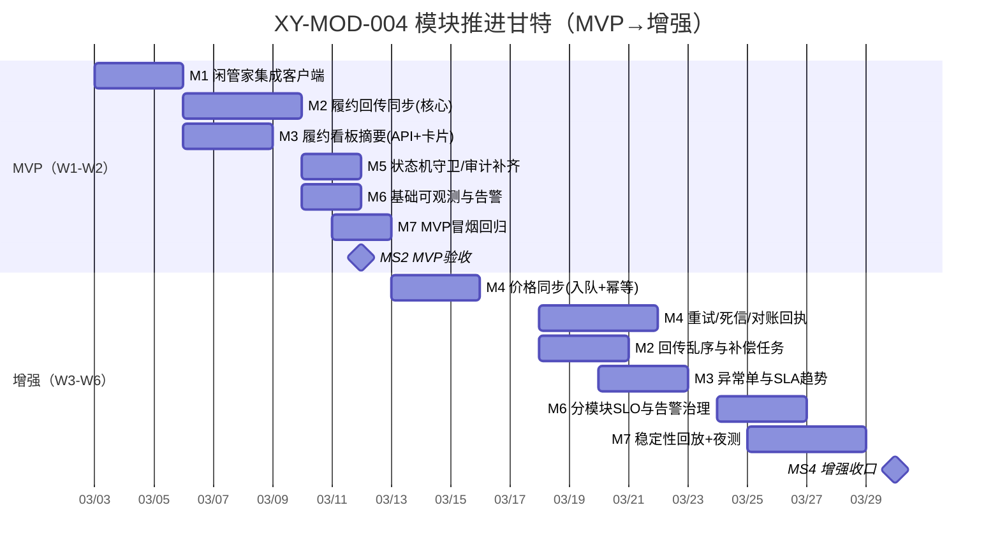

# 模块推进路线图（XY-MOD-004）

- 任务ID：XY-MOD-004
- 输出时间：2026-03-02 16:30 (Asia/Shanghai)
- 目标：按“先 MVP 后增强”推进，给出可执行排期甘特 + 责任矩阵 + 周节奏模板
- 适用范围：`/Users/brianzhibo/Documents/New project/xianyu-openclaw`

---

## 1) 目标与分批策略

### 1.1 总目标（6周）
- **W1-W2（MVP）**：打通“订单履约闭环 + 履约看板最小可用 + 风险可控降级”。
- **W3-W6（增强）**：补齐价格同步、异常治理、可观测与自动化运维，形成稳定运营能力。

### 1.2 分批原则
1. **先主链路**：订单 upsert → deliver → 回传 → dashboard 可见。
2. **先可回滚**：每个模块必须有 feature flag / 降级路径。
3. **先审计再扩展**：所有跨系统动作必须留 request_id / order_id / error_code。

---

## 2) 模块清单（含负责人建议、工时、依赖）

> 工时口径：人日（PD，1PD=1人*1天）

| 优先级 | 模块 | MVP/增强范围 | 负责人建议（Owner） | 估算工时 | 主要依赖 | 关键阻塞（风险级别） |
|---|---|---|---|---:|---|---|
| P0 | M1-闲管家集成客户端（xianguanjia-client） | MVP：鉴权、统一错误码、重试超时；增强：错误语义分层、熔断 | **后端负责人（集成）** | MVP 3PD / 增强 2PD | 外部接口文档、测试账号 | 外部鉴权波动（P0） |
| P0 | M2-履约回传同步（shipping-sync） | MVP：回传入库、幂等、状态推进；增强：乱序处理、补偿任务 | **后端负责人（订单域）** | MVP 4PD / 增强 3PD | M1、orders schema | 回传字段不完整（P0） |
| P0 | M3-履约看板摘要（dashboard-fulfillment） | MVP：summary API + 卡片；增强：异常单列表、SLA趋势 | **全栈负责人（dashboard）** | MVP 3PD / 增强 3PD | M2、dashboard API规范 | 指标口径不一致（P1） |
| P1 | M4-价格同步（price-sync） | MVP：事件入队+幂等；增强：重试/死信/对账回执 | **后端负责人（运营域）** | MVP 3PD / 增强 4PD | operations service、M1 | UI改价不稳定（P1） |
| P1 | M5-状态机与数据治理 | MVP：状态机守卫、审计字段补齐；增强：历史修复脚本 | **架构/后端 owner** | MVP 2PD / 增强 2PD | M2、数据库迁移 | 历史脏数据（P1） |
| P1 | M6-可观测与告警 | MVP：错误码/延迟埋点、告警阈值；增强：分模块SLO | **SRE/平台 owner** | MVP 2PD / 增强 3PD | 日志/监控基础设施 | 告警误报漏报（P2） |
| P2 | M7-联调与回归自动化 | MVP：冒烟链路；增强：稳定性回放与夜测 | **QA负责人** | MVP 2PD / 增强 4PD | 测试环境、Mock/沙箱 | 环境不稳定（P1） |

**总计**：MVP 19PD；增强 21PD；全量 40PD（建议 4~5 人并行，6 周可落地）。

---

## 3) 里程碑与可执行甘特（按周）

### 3.1 里程碑定义
- **MS1（W1末）**：M1 完成 + M2 开发完成 60%（可收回传样例）
- **MS2（W2末）**：MVP 全量验收通过（闭环可跑、可观测、可回滚）
- **MS3（W4末）**：增强一期完成（价格同步+异常治理）
- **MS4（W6末）**：增强二期完成（SLO稳定+自动化回归）

### 3.2 甘特（Mermaid，可直接粘贴到支持 Mermaid 的文档/飞书）

---

## 4) 责任矩阵（RACI）

> 角色缩写：
> - PMO：项目管理
> - BE-I：后端集成负责人
> - BE-O：后端订单/运营负责人
> - FE：前端/看板负责人
> - QA：测试负责人
> - SRE：平台运维负责人

| 工作项 | PMO | BE-I | BE-O | FE | QA | SRE |
|---|---|---|---|---|---|---|
| M1 xianguanjia-client | A | R | C | I | C | C |
| M2 shipping-sync | A | C | R | I | C | C |
| M3 dashboard-fulfillment | A | I | C | R | C | I |
| M4 price-sync | A | C | R | I | C | C |
| M5 状态机/数据治理 | A | C | R | I | C | C |
| M6 可观测与告警 | A | C | C | I | C | R |
| M7 联调回归 | A | C | C | C | R | C |
| 里程碑验收（MS1~MS4） | A/R | C | C | C | C | C |

---

## 5) 依赖与阻塞清单（含缓解动作）

| 编号 | 风险级别 | 依赖/阻塞 | 触发条件 | 缓解动作 | 截止时间 | Owner |
|---|---|---|---|---|---|---|
| D-01 | P0 | 外部鉴权不稳定（Cookie/Token） | 连续 3 次 token 刷新失败 | 启用熔断 + 手工恢复入口 + 30 分钟告警 | W1-D2 | BE-I |
| D-02 | P0 | 回传字段缺失导致状态无法推进 | 缺 tracking_no/courier_code | 定义最小必填协议；缺字段事件进入待补偿队列 | W1-D3 | BE-O |
| D-03 | P1 | 看板指标口径不统一 | API 与 DB 统计口径偏差>2% | 统一指标字典，评审后冻结口径 | W2-D1 | FE |
| D-04 | P1 | UI 改价路径不稳定 | 自动化改价失败率>5% | price-sync 入队 + 限流重试 + 人工接管提示 | W3-D2 | BE-O |
| D-05 | P1 | 测试环境不稳定 | 联调连续中断 > 2h | 增加沙箱回放数据 + 夜间回归窗口 | W3-D3 | QA |
| D-06 | P2 | 告警噪声过高 | 日均误报>20% | 分级告警与静默策略，按模块阈值调优 | W4-D5 | SRE |

---

## 6) 周节奏汇报模板（可直接复用）

### 6.1 周报模板（结构化）

#### A. 目标（本周）
- 目标1：
- 目标2：
- 目标3：

#### B. 进度（量化）
- M1：计划 xx%，实际 xx%，偏差 xx%
- M2：计划 xx%，实际 xx%，偏差 xx%
- 本周交付：`PR数 / 已验收项 / 未完成项`

#### C. 风险（分级）
- P0：
  - 描述：
  - 影响：
  - 缓解动作：
  - 负责人 / 截止：
- P1：
- P2：

#### D. 下周计划（可验证）
- [ ] 任务A（Owner / Deadline / 验收标准）
- [ ] 任务B（Owner / Deadline / 验收标准）

#### E. 需升级决策（若有）
- 决策事项：
- 需要拍板时间：
- 备选方案：

### 6.2 周会节奏建议（固定）
- **周一 10:00**：计划锁定会（冻结本周目标与依赖）
- **周三 18:00**：中检会（偏差纠正与风险升级）
- **周五 17:30**：验收会（按里程碑口径过门禁）

---

## 7) 执行门禁（Definition of Done）

每个模块完成需同时满足：
1. 有 owner、deadline、验收标准；
2. 有回滚开关（feature flag 或降级路径）；
3. 有最小监控（成功率、失败数、P95 时延）；
4. 有测试证据（冒烟或回归报告链接）；
5. 里程碑记录更新到项目看板。

---

## 8) 立即执行清单（今天可启动）

- [ ] 指派模块 owner（M1~M7）并确认可用人天（今天 18:00 前）
- [ ] 冻结 MVP 范围（仅 M1/M2/M3/M5/M6/M7 的 MVP 子集）
- [ ] 建立风险台账 D-01~D-06 并在周会上逐条跟踪
- [ ] 在 dashboard 增加临时“履约MVP状态”卡片，确保管理层可视
